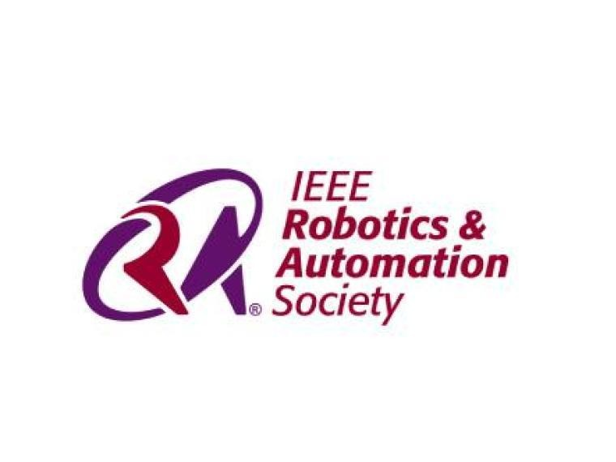

# ⚡ IEEE RAS VIT Chennai — Official Web Portal

<div align="center">
  
  
  <p align="center">
    <strong>Advancing the Theory, Practice, and Scientific Foundations of Robotics & Automation</strong>
  </p>
  <p align="center">
    IEEE Robotics and Automation Society (RAS) Student Chapter • VIT Chennai Student Branch (Est. 2011)
  </p>
  
  <p align="center">
    <a href="https://ieeerasvitc.vercel.app/"></a>
    <a href="https://www.linkedin.com/company/ieeerasvitc"></a>
    <a href="https://badgr.com/public/issuers/3zOGysYoRTmLUXAcMOZ3Hg"></a>
    
    
  </p>
</div>

---

## 📖 Overview

The **IEEE Robotics and Automation Society (RAS) Student Chapter at VIT Chennai** is a premier technical student society dedicated to fostering engineering excellence in autonomous robotics, mechatronics, embedded systems, and embodied artificial intelligence. 

Inaugurated on **August 7, 2018**, under the School of Electronics Engineering (SENSE), the chapter operates under the aegis of the broader **IEEE Student Branch at VIT Chennai** (established in 2011). It provides a collaborative environment for students to build prototypes, publish scientific papers, and participate in national and international technical competitions.

---

## ✨ Key Platform Features

### 1. 🤖 Dynamic SVG Robotic Arm HUD
* **Component:** `RoboticArm.jsx`
* **Real-time Joint Articulation:** A custom-engineered vector manipulator arm that calculates joint kinematics (`base`, `shoulder`, `elbow`, `wrist`) and articulates its 6-DOF physical pose dynamically as the user scrolls between sections.
* **Viewport Tracking:** Persistent floating glassmorphic HUD in the viewport displaying active section telemetry and joint lock status.

### 2. 🌌 Cinematic Crossfading Background Engine
A dynamic atmospheric background engine that smoothly crossfades between full-bleed imagery as users navigate the platform:
* **Hero Viewport:** High-precision industrial robotic arm telemetry with cybernetic bokeh (`telemetry-robotic-arm.jpg`).
* **Charter & Domains:** Embodied cognition equations, neural networks, and mathematical formulations (`embodied-ai-chalkboard.jpg`).
* **Research & Flagship Events:** Sci-fi humanoid robot corridor spotlighting the IEEE Robotics & Automation Magazine (*Vol. 33, No. 1, March 2026 — "Embodied AI"*) (`ram-magazine-embodied-ai.jpg`).
* **Vignette & Contrast Protection:** Multi-layered radial and linear dark gradients ensuring WCAG AAA legibility.

### 3. 👥 Organizational Structure & Executive Leadership
* **Faculty Coordination & Academic Supervision:**
  * **Dr. D. Vydeki** — Faculty Coordinator, School of Electronics Engineering (SENSE)
  * **Dr. C. Umayal** — Faculty Coordinator, School of Electrical Engineering (SELECT)
  * **Dr. Suchetha M** — Founding Faculty Coordinator (SENSE)
* **Elected Student Executive Board (2025–2026):**
  * **Chairperson:** [Derrick S Richard](https://www.linkedin.com/in/derrick-s-richard) (Tenure: August 2025 – Present)
  * **Data Science Co-Lead:** [Nikhil Bansal](https://www.linkedin.com/in/nikhil-bansal-v-a5a66728b) (Tenure: 2024 – 2026)
  * **Operations & Management Lead:** [Koushik Varma](https://www.linkedin.com/in/koushik-varma-32019428b) (Tenure: February 2024 – Present)

### 4. 🏆 Flagship Hackathons & Competitions
* **TechnoVIT Series:** Annual campus technical festival hosting specialized robotics competitions such as *"RasPi Fusion"* (single-board sensor fusion), *"Intelligence Edge ML"*, and the *"RoverX Mechanical Workshop"*.
* **Continuous Hackathons:** *RASCade 36-Hour Hackathon* for rapid prototype building, *Haxios Hackathon*, and *"Makers Gonna Make"*.
* **IEEE Day Celebrations:** Robotics quizzes, engineering idea battles, debates, and industry guest lectures (including Fiat Chrysler Automobiles).
* **Verifiable Digital Badging:** Integrated [Badgr Issuer Profile](https://badgr.com/public/issuers/3zOGysYoRTmLUXAcMOZ3Hg) for cryptographically verifiable digital certificates and achievement badges.

---

## 🛠️ Tech Stack & Dependencies

* **Frontend Framework:** [React 19](https://react.dev/)
* **Build Tool:** [Vite 8](https://vitejs.dev/)
* **Styling:** [Tailwind CSS v4](https://tailwindcss.com/)
* **Motion Physics:** [Framer Motion](https://www.framer.com/motion/)
* **Quality & Linting:** ESLint (Zero warnings/errors)

---

## 📂 Project Architecture

```plaintext
ieee-ras-vitc/
├── public/
│   ├── ras-logo.jpg                      # Official IEEE RAS high-res emblem
│   ├── telemetry-robotic-arm.jpg         # Hero robotic arm telemetry background
│   ├── embodied-ai-chalkboard.jpg        # Neural dynamics & math chalkboard background
│   ├── ram-magazine-embodied-ai.jpg      # IEEE RAM Embodied AI magazine background
│   └── favicon.svg
├── src/
│   ├── components/
│   │   ├── RoboticArm.jsx                # Vector SVG kinematic articulator with scroll tracking
│   │   ├── Domains.jsx                   # Department explorer module
│   │   ├── History.jsx                   # Chapter founding manifest
│   │   ├── Navbar.jsx                    # Navigation header
│   │   └── Footer.jsx                    # Footer component
│   ├── App.jsx                           # Main application, background engine & sections
│   ├── index.css                         # Tailwind CSS v4 & glassmorphic utility rules
│   └── main.jsx                          # React 19 entrypoint
├── package.json
└── vite.config.js
```

---

## 💻 Local Development

Follow these steps to run the application locally:

### 1. Clone the repository
```bash
git clone https://github.com/Arun-2326/ieee-ras-vitc.git
cd ieee-ras-vitc
```

### 2. Install dependencies
```bash
npm install
```

### 3. Start the development server
```bash
npm run dev
```
The application will launch at `http://localhost:5173/`.

### 4. Build for production
```bash
npm run build
```

---

## 📬 Official Contact & Channels

* **Official Website:** [https://ieeerasvitc.vercel.app/](https://ieeerasvitc.vercel.app/)
* **LinkedIn:** [IEEE RAS VIT Chennai](https://www.linkedin.com/company/ieeerasvitc)
* **Instagram:** [@ieeerasvitc](https://instagram.com/ieeerasvitc)
* **Chapter Email:** [ieeerasvitchennai@gmail.com](mailto:ieeerasvitchennai@gmail.com)
* **Institutional Inquiries:** [deancc.sense@vit.ac.in](mailto:deancc.sense@vit.ac.in)
* **Campus Address:** VIT Chennai, Vandalur–Kelambakkam Road, Chennai – 600127, Tamil Nadu, India
* **Telephone:** +91 44 3993 1026

---

<p align="center">
  © IEEE RAS VIT Chennai Student Chapter • Under IEEE Student Branch VIT Chennai (Est. 2011)
</p>